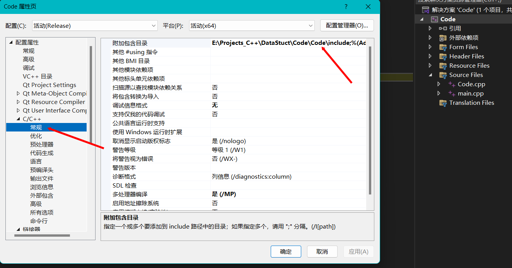
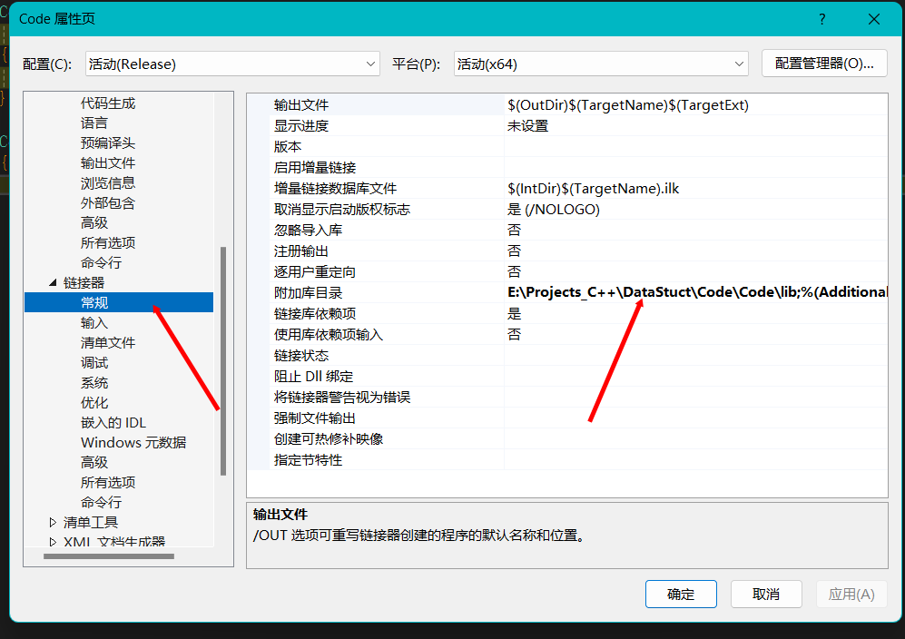
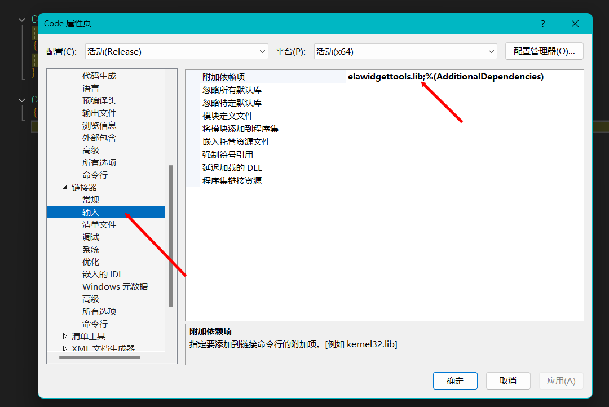

# LibrarySystem

#### 介绍
数据结构课设——图书管理系统

#### 软件架构
软件架构说明

#### 环境配置

1. **配置include**

   在项目属性->C/C++->常规->附加包含目录中添加include文件夹的路径

   

     
   

2. **配置lib**--第一步

   在项目属性->链接器->常规->附加库目录中添加lib文件夹的路径

   

     
   

3. **配置lib**--第二步

   在项目属性->链接器->输入->附加依赖项中添加elawidgettools.lib

   

     
   

